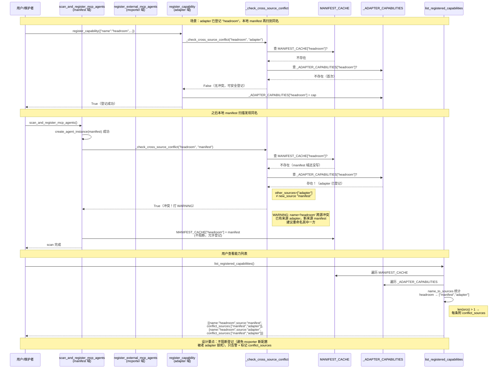

# 遗留风险待办清单 + 防御逻辑流程图

> **配套文档**：[多智能体审查与修复总结报告_2026-08-09.md](file:///d:/my/git/scratchpad/REPORTS/多智能体审查与修复总结报告_2026-08-09.md)
> **用途**：① 待办事项可复制到 Issue Tracker 安排修复 ② 流程图可直接用于团队技术分享
> **日期**：2026-08-09

---

## Part A — 遗留风险待办清单

### ARC-1 [MEDIUM] memclaw 退化外壳调用 SqliteBackend 私有方法 `_get_db()`，vendor 升级即炸

| 字段 | 内容 |
|---|---|
| **优先级** | MEDIUM |
| **影响范围** | `mcpserver/adapters/memclaw.py` register() 退化分支（PEP 695 语法不兼容时走的 SQLite standalone 路径） |
| **问题描述** | memclaw adapter 在 PEP 695 退化模式下，直接调用 `caura_memclaw.storage.sqlite_backend.SqliteBackend._get_db()` 私有方法获取连接，然后用 `conn.execute(SQL, params)` 裸查。SQL 虽然是参数化 `?` 占位符（无 SQL 注入），但 `_get_db()` 是 vendor 内部 API，`caura-memclaw` 任何 minor 版本更新调整该方法签名 / 返回类型 / 换后端接口 → adapter 直接 AttributeError 或 TypeError，用户看到 "能力卡片可用但工具调用报错"。 |
| **触发场景** | ① `pip install -U caura-memclaw` 升级 vendor 版本 ② vendor 在 minor 版本中重命名 `_get_db()` → `_get_connection()` 或换成 async 接口 |
| **修复方案** | 1. 检查 `caura-memclaw` 是否暴露 public 稳定 API（如 `SqliteBackend.list_memories()` / `write_memory()`），有则替换裸 SQL 调用<br>2. 若无 public API，在 adapter 侧用 `getattr(backend, "list_memories", None)` 探测，不可用时退化到仅登记能力卡片不注册工具（与当前 PEP 695 退化一致）<br>3. 在 `requirements` / `vendor pin` 中锁定 `caura-memclaw` 当前版本号，避免静默升级 |
| **验收标准** | ① 升级 `caura-memclaw` 到下一版本后 memclaw adapter healthcheck 仍返回 True ② 若 API 不可用，adapter 退化到能力卡片模式而非抛异常 ③ 对应 unittest case 覆盖 public API 探测逻辑 |
| **建议时机** | 下一轮 memclaw vendor 版本升级时同步处理 |

---

### LOW-F1 headroom CAPABILITY 缺 `degradation_mode` 建议字段

| 字段 | 内容 |
|---|---|
| **优先级** | LOW |
| **影响范围** | `mcpserver/adapters/headroom.py` 模块级 `CAPABILITY` dict |
| **问题描述** | headroom 有 "Rust Kompress-v2 → 纯 Python" 退化分支，register() 里通过 `try: from headroom import _core` 检测 Rust 扩展可用性。但 CAPABILITY 卡片字段没体现退化模式，用户看能力卡片以为 Rust 高性能压缩可用，实际可能走纯 Python pipeline（性能差 3-5x）。 |
| **修复方案** | 在 `CAPABILITY` dict 加一行：<br>`"degradation_mode": "auto-fallback-to-pure-python-if-rust-core-missing"` |
| **验收标准** | `list_registered_capabilities()` 返回的 headroom 条目含 `degradation_mode` 字段 |
| **建议时机** | 顺手补，非阻塞 |

---

### LOW-F2 memclaw 常态 CAPABILITY 缺 `security_notice`

| 字段 | 内容 |
|---|---|
| **优先级** | LOW |
| **影响范围** | `mcpserver/adapters/memclaw.py` 模块级 `CAPABILITY` dict（当前 `security_notice` 只在退化分支的 `degraded_cap` 临时字典里） |
| **问题描述** | memclaw SQLite standalone 模式下，本地存储无加密无 ACL，多用户共用同一 `.db` 文件时数据互相可见。模块级主 CAPABILITY 没标注这个安全须知，只有退化到 degraded_cap 时才临时加。 |
| **修复方案** | 在模块级 `CAPABILITY` dict 加一行：<br>`"security_notice": "SQLite standalone 模式：本地存储无加密/无 ACL，多用户场景需隔离 db 文件路径（MEMCLAW_DB_PATH）"` |
| **验收标准** | `list_registered_capabilities()` 返回的 memclaw 条目含 `security_notice` 字段 |
| **建议时机** | 顺手补，非阻塞 |

---

### LOW-M1 scientific-agent-skills 缺 adapter 与 CAPABILITY

| 字段 | 内容 |
|---|---|
| **优先级** | LOW |
| **影响范围** | `mcpserver/adapters/` 目录（缺 `scientific_agent_skills.py`） |
| **问题描述** | `vendor/top5/scientific-agent-skills` 源目录已存在但无适配层入口。用户想启用对应能力 → adapters 无 `_ADAPTERS` 注册项 → 只能手动写 import 绕过门禁。 |
| **修复方案** | 1. 新建 `mcpserver/adapters/scientific_agent_skills.py`<br>2. 模块级 `CAPABILITY` 常量（7 字段 + `_from_adapter`）<br>3. `healthcheck()` 调 `inject_vendor_path("scientific-agent-skills")` + 探测入口模块<br>4. `register()` 用 `merge_tools()` 合并 vendor FastMCP 工具<br>5. 在 `__init__.py` 的 `_ADAPTERS` 注册 `"scientific_agent_skills": ("mcpserver.adapters.scientific_agent_skills", "ENABLE_ADAPTER_SCIENTIFIC_AGENT_SKILLS")` |
| **验收标准** | ① healthcheck 通过 ② `list_registered_capabilities()` 出现 `scientific_agent_skills` 条目 ③ 对应 unittest case 覆盖 |
| **建议时机** | 下一阶段 top5 收尾，单独一个 commit |

---

## Part B — 防御逻辑流程图（Mermaid，技术分享用）

### 图 1：跨源查重时序图（HIGH-2 修复）



---

### 图 2：inject_vendor_path 路径逃逸防御流程图（MEDIUM-3 修复）

```mermaid
flowchart TD
    Start([inject_vendor_path<br/>name, *subpaths]) --> CheckMemory{name 已在<br/>_INJECTED_VENDORS?}
    CheckMemory -->|是| Return([return 早退])
    CheckMemory -->|否| NameBoundary

    subgraph 防御层 1：name 边界
        NameBoundary["resolve: (_VENDOR_TOP5 / name).resolve()<br/>.relative_to(_VENDOR_TOP5.resolve())"] --> NameOK{在边界内?}
        NameOK -->|否<br/>ValueError/OSError| NameReject["WARNING: name 跳出边界<br/>拒绝注入"]
        NameReject --> Return
        NameOK -->|是| SubLoop
    end

    subgraph 防御层 2：subpath 逐条边界
        SubLoop["for sub in reversed(subpaths)"] --> SubBoundary["resolve: (root / sub).resolve()<br/>.relative_to(_VENDOR_TOP5.resolve())"]
        SubBoundary --> SubOK{在边界内?}
        SubOK -->|否| SubSkip["WARNING: subpath 跳出边界<br/>跳过这一条<br/>continue 下一条"]
        SubSkip --> SubLoop
        SubOK -->|是| SubInject["sys.path.insert(0, path)<br/>added.append(path)"]
        SubInject --> SubLoop
    end

    SubLoop -->|所有 subpath 处理完| RootCheck

    subgraph 防御层 3：根目录存在性
        RootCheck{"root.is_dir()?<br/>+ OSError 兜底"} -->|不存在| RootSkip["WARNING: vendor 源目录不存在<br/>跳过根目录注入"]
        RootSkip --> AddedCheck{added 列表为空?}
        AddedCheck -->|是| NoMemory["不记入 _INJECTED_VENDORS<br/>允许下次重试"]
        NoMemory --> Return
        AddedCheck -->|否<br/>有合法子路径已注入| WriteMemory
        RootCheck -->|存在| RootInject["sys.path.insert(0, root)<br/>added.append(root)"]
        RootInject --> WriteMemory
        RootCheck -->|OSError| RootSkip
    end

    WriteMemory["_INJECTED_VENDORS[name] = added<br/>记录注入记忆"]
    WriteMemory --> Return

    style NameReject fill:#ffcccc,stroke:#cc0000
    style SubSkip fill:#ffe6cc,stroke:#cc8800
    style RootSkip fill:#ffe6cc,stroke:#cc8800
    style NoMemory fill:#fff2cc,stroke:#d6b656
    style SubInject fill:#d9ead3,stroke:#93c47d
    style RootInject fill:#d9ead3,stroke:#93c47d
    style WriteMemory fill:#c9daf8,stroke:#3c78d8
```

---

### 图 3：门禁 6 步流程总览（HIGH-1 + MEDIUM-4 修复后的完整链路）

```mermaid
flowchart TD
    Start([register_all_adapters]) --> Step1{"步骤1: ENABLE_ADAPTER_*<br/>env 开关?"}
    Step1 -->|关| Skip[跳过该 adapter]
    Step1 -->|开| Step2["步骤2: import adapter 模块"]
    Step2 -->|import 失败| Skip
    Step2 -->|import 成功| Step3

    subgraph 步骤3：双重校验 不短路
        Step3["validate_adapter(mod, name)<br/>深度校验 7 字段 + 三线对齐"] --> Step3b{"isinstance(mod,<br/>MCPAdapterModule)?"}
        Step3b -->|否 且 issues 空| Step3c["兜底追加:<br/>不满足 Protocol 三要素"]
        Step3b -->|是| Step3d{"validate_adapter<br/>有 issues?"}
        Step3c --> Step3d
        Step3d -->|有 issues| Step3Fail["WARNING + continue<br/>跳过此 adapter"]
        Step3d -->|无 issues| Step4
    end

    subgraph 步骤4：冲突检测 立即写入
        Step4["读 _ADAPTER_CAPABILITY_NAMES<br/>[cap_name]"] --> Step4b{"prev 存在且<br/>prev != cap_from?"}
        Step4b -->|是| Step4Fail["WARNING: name 已被占用<br/>continue 跳过"]
        Step4b -->|否| Step4Write["_ADAPTER_CAPABILITY_NAMES<br/>[cap_name] = cap_from<br/>立即写入"]
        Step4Write --> Step5
    end

    Step5["步骤5: healthcheck()"] -->|返回 False| Step5Fail["WARNING + continue"]
    Step5 -->|返回 True| Step6["步骤6: register(mcp_server)<br/>注册工具 + register_capability_safe"]
    Step6 -->|异常| Step6Fail["WARNING + continue<br/>不回滚已注册工具"]
    Step6 -->|成功| Done["names.append(name)"]
    Done --> NextLoop{还有下一个<br/>adapter?}
    NextLoop -->|是| Step1
    NextLoop -->|否| End([return names])

    style Step3Fail fill:#ffcccc,stroke:#cc0000
    style Step4Fail fill:#ffcccc,stroke:#cc0000
    style Step5Fail fill:#ffcccc,stroke:#cc0000
    style Step6Fail fill:#ffcccc,stroke:#cc0000
    style Step4Write fill:#c9daf8,stroke:#3c78d8
    style Done fill:#d9ead3,stroke:#93c47d
```

---

### 分享要点提示

**跨源查重（图 1）关键讲 3 点：**
1. **不阻断是故意的** — 避免 mcporter 新配置被老 adapter 锁死；只打 WARNING + list 里标 `conflict_sources`
2. **三源三路径** — manifest(scan) / mcporter(external) / adapter(capability) 各自独立写入，`_check_cross_source_conflict` 是唯一跨源查重点
3. **用户端零成本** — 看 `list_registered_capabilities()` 返回的 `conflict_sources` 字段就知道有没有重名，不用翻日志

**路径逃逸防御（图 2）关键讲 3 点：**
1. **3 层防御互不株连** — name 越界整体拒绝；subpath 越界只跳过那一条；根目录不存在只跳过根目录。不会因为一个非法 subpath 连累合法路径注入
2. **失败语义优雅降级** — added 为空时不记 `_INJECTED_VENDORS`，允许 vendor 补目录后下次重试自动成功
3. **resolve().relative_to() 是 Python 路径逃逸防御的标准模式** — 比 `startswith()` 字符串比较更安全，能处理符号链接和 `..` 归一化

**门禁 6 步（图 3）关键讲 2 点：**
1. **isinstance 不再短路** — Protocol isinstance 只是 hasattr 三要素，字段级深度校验必须靠 validate_adapter，不能跳过
2. **步骤 4 立即写入** — 不依赖 register() 内部自觉调 safe，门禁通过即写 `_ADAPTER_CAPABILITY_NAMES`，保证后续同名 adapter 冲突检测不漏报
